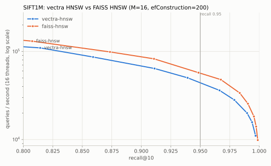
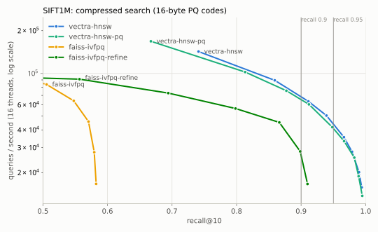
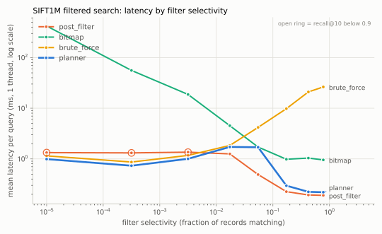
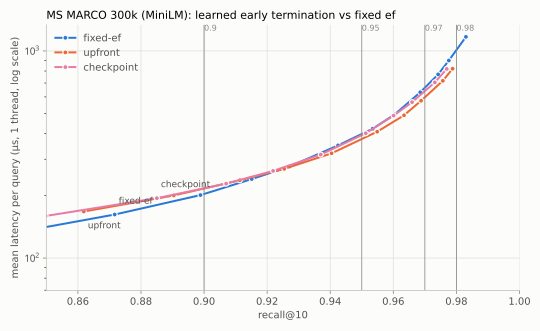

# siftdb

A vector database built from scratch in Python + Numba. It has hand-written
**HNSW** and **product quantization**, **attribute-filtered search** driven by a
selectivity-based query planner, **write-ahead-log + snapshot durability** that
survives `kill -9`, a **gRPC** API, and a **LightGBM model that tries to learn
when to stop searching**. It is benchmarked against FAISS on SIFT1M and on 300k
MS MARCO passages embedded with MiniLM.

There is no C/C++/Rust/Cython and no ANN library in the engine. Every hot loop is
an `@njit` Numba kernel over flat NumPy arrays: graph traversal, distance
kernels, PQ scanning, and even tree-ensemble evaluation. FAISS appears only in
`bench/`, as the baseline.

## Results at a glance

All numbers are from one laptop (i5-13500HX, 14 cores / 20 threads, 32 GB,
Windows 11), are regenerated by the commands under
[Reproducing](#reproducing), and are pasted from `python -m bench.report`.

| milestone | target | result | |
|---|---|---|---|
| HNSW vs FAISS (SIFT1M) | within ~2x of FAISS QPS at recall@10 = 0.95; 1M build < 15 min | 44.1k vs 56.6k QPS (FAISS 1.28x faster); build **46 s** (FAISS 55 s) | ✅ |
| PQ + exact re-rank | >= 8x smaller index, recall@10 >= 0.90 | vectors in RAM **488 → 15.4 MiB (31.7x)** at ~95% of full-precision throughput, recall up to 0.995. The whole resident index shrinks 4.2x because the graph (131 MiB) is not compressed | ✅ vectors / ⚠️ whole index |
| Filters + planner | property tests pass; planner beats every fixed strategy on a mixed workload | **0.84 ms at recall 0.968**, vs 8.9 ms brute force and 53.6 ms bitmap-only. Post-filter alone is 0.79 ms but misses a third of the true neighbours (recall 0.655) | ✅ |
| Durability | crash test passes 100/100 | **100/100** `kill -9` runs, 132,553 acknowledged records verified bit-for-bit | ✅ |
| Learned early stop | >= 25% lower latency at equal recall, both datasets | **Not met.** SIFT1M: 5–15% *slower*. MS MARCO: 5.4% faster at recall 0.95, 10.1% at 0.97. See [why](#learned-early-termination-a-negative-result) | ❌ |

## Benchmarks

### HNSW vs FAISS HNSW (SIFT1M, M=16, efConstruction=200)



| engine | build (16 threads) | index RAM | QPS @ recall 0.95 | ef for 0.95 | 1-thread p50 / p99 @ ef=64 |
|---|---|---|---|---|---|
| siftdb-hnsw | 46 s | 619 MiB | 44.1k | 96 | 134 / 165 µs |
| faiss-hnsw | 55 s | 626 MiB | 56.6k | 64 | 139 / 171 µs |

At the same `ef`, siftdb's search is as fast as FAISS's, but its graph gives a
little less recall per unit of `ef`. There are two likely causes, neither isolated
yet. FAISS gives each new node up to `2M` layer-0 links at insert time, while
siftdb gives `M` (the hnswlib convention). And siftdb's parallel build never links
nodes that land in the same insertion batch.

### Compressed search (SIFT1M, 16-byte PQ codes)



| engine | index RAM | vectors held in RAM | QPS @ 0.90 | QPS @ 0.95 | best recall |
|---|---|---|---|---|---|
| siftdb-hnsw | 619 MiB | float32 (488 MiB) | 68.4k | 43.9k | 0.994 |
| siftdb-hnsw-pq | 146 MiB | 16-byte codes (15.4 MiB) | 65.3k | 40.9k | 0.995 |
| faiss-ivfpq | 25 MiB | 16-byte codes | n/a | n/a | 0.582 |
| faiss-ivfpq-refine | 513 MiB | float32 (488 MiB) | 26.4k | n/a | 0.910 |

In PQ mode the graph is traversed on compressed distances. The best `2 x ef`
candidates are then re-ranked exactly from the memory-mapped full vectors, which
live on disk and are only paged in for re-ranking. The result is ~95% of the
throughput of full-precision HNSW with 31.7x less vector data resident. "n/a"
means that engine never reaches the recall target.

### Filtered search (SIFT1M + synthetic attributes, 1,000 mixed-selectivity queries)



| strategy | mean latency | p99 | recall@10 |
|---|---|---|---|
| post_filter | 0.79 ms | 1.7 ms | 0.655 |
| bitmap | 53.60 ms | 430.4 ms | 0.988 |
| brute_force | 8.88 ms | 29.5 ms | 1.000 |
| **planner** | **0.84 ms** | 2.9 ms | 0.968 |

| selectivity | queries | post_filter | bitmap | brute_force | planner |
|---|---|---|---|---|---|
| 0–0.0001 | 105 | 1.33 ms (0.00) | 420.30 ms (1.00) | 1.15 ms (1.00) | 0.99 ms (1.00) |
| 0.0001–0.001 | 80 | 1.31 ms (0.09) | 55.76 ms (1.00) | 0.87 ms (1.00) | 0.73 ms (1.00) |
| 0.001–0.01 | 214 | 1.36 ms (0.42) | 18.71 ms (1.00) | 1.17 ms (1.00) | 1.00 ms (1.00) |
| 0.01–0.03 | 91 | 1.25 ms (0.94) | 4.52 ms (1.00) | 1.84 ms (1.00) | 1.72 ms (1.00) |
| 0.03–0.1 | 125 | 0.49 ms (0.95) | 1.71 ms (1.00) | 4.18 ms (1.00) | 1.69 ms (1.00) |
| 0.1–0.3 | 103 | 0.23 ms (0.92) | 0.98 ms (0.99) | 9.80 ms (1.00) | 0.30 ms (0.93) |
| 0.3–0.6 | 129 | 0.19 ms (0.91) | 1.04 ms (0.97) | 20.98 ms (1.00) | 0.22 ms (0.91) |
| 0.6–1.01 | 153 | 0.19 ms (0.91) | 0.95 ms (0.95) | 26.35 ms (1.00) | 0.22 ms (0.91) |

Each cell shows mean latency with recall@10 in parentheses. No single strategy
wins everywhere: bitmap-constrained HNSW collapses on very selective filters
(the walk keeps missing matches), brute force grows linearly with the matching
set, and post-filtering loses recall as soon as matches get rare. The planner's
thresholds were tuned by running the planner itself over a grid on *learn*
queries (`configs/bench/sift1m_filters_tune.yaml`), picking the fastest setting
with recall@10 >= 0.95.

### Learned early termination: a negative result



| dataset | recall | fixed ef | upfront (Δ) | checkpoint (Δ) | Δ distance computations (upfront / checkpoint) |
|---|---|---|---|---|---|
| SIFT1M | 0.9 | 108 µs | 122 µs (+13.3%) | 124 µs (+14.9%) | +1.5% / -0.2% |
| SIFT1M | 0.95 | 150 µs | 163 µs (+8.7%) | 168 µs (+12.3%) | +1.4% / -3.5% |
| SIFT1M | 0.98 | 232 µs | 244 µs (+4.8%) | 261 µs (+12.2%) | +0.5% / -7.2% |
| SIFT1M | 0.99 | 316 µs | 332 µs (+5.2%) | 360 µs (+14.2%) | +0.5% / -7.1% |
| MS MARCO 300k | 0.9 | 204 µs | 217 µs (+6.3%) | 217 µs (+6.5%) | -0.5% / -3.6% |
| MS MARCO 300k | 0.95 | 397 µs | 376 µs (-5.4%) | 392 µs (-1.3%) | -8.8% / -12.2% |
| MS MARCO 300k | 0.97 | 665 µs | 598 µs (-10.1%) | 640 µs (-3.7%) | -11.9% / -13.6% |

Single-threaded mean latency per query, pinned to one P-core, at matched recall;
negative Δ is better. The spec's goal was a >= 25% latency reduction at equal
recall on both datasets. **It was not reached.** The model helps a little on the
neural dataset at high recall, and costs more than it saves on SIFT1M.

The headroom exists. On held-out learn queries, an oracle that knew each
query's exact budget reaches recall 0.997 on SIFT1M at a mean of 77 expansions;
fixed `ef` needs ~380 for the same recall. The model just can't *see* which queries are
hard. The best checkpoint model explains only ~39% of the variance in log(budget)
(R² 0.39; 0.23 for the up-front model). Replaying the stopping policies offline,
with zero runtime overhead, bounds the saving at ~8–13% of distance
computations on SIFT1M and ~10–17% on MS MARCO. Trying a classifier ("is the
top-k complete yet?") instead of a regressor, and adding an intrinsic-dimension
feature, did not move that bound. The measured numbers above sit where that
analysis says they should, once the model's own cost is paid. Getting there took
removing ~2x of overhead first (see bug #2 below).

The model therefore ships **off by default** (`early_stop.model: null`). A
collection can load a trained model (`python -m ml.early_stop ...`), in which
case searches without an explicit `ef` use a per-query budget.

### Crash recovery

100/100 kill -9 runs recovered every acknowledged write (132,553 acknowledged
records verified bit-for-bit; 5 kills landed mid-delete). The harness
(`bench/crash.py`) starts a writer subprocess that upserts and deletes in random
batches and prints an ack after each call returns. It hard-kills the writer at a
random moment (`TerminateProcess` on Windows, `SIGKILL` elsewhere), across three
snapshot cadences, then recovers in-process. The check: every acknowledged
record is present with a bit-identical vector and attributes, every
acknowledged delete is gone, anything unacknowledged that survived is not
corrupt, and the graph is consistent and searchable. `pytest` runs a short
version of the same test on every run.

## Architecture

```
gRPC API (api/)  ─►  query planner (engine/planner.py)
                        │  filter strategy from estimated selectivity
                        │  search budget: explicit ef │ learned model │ config default
                        ▼
      index layer: HNSW (index/hnsw.py) · PQ (index/pq.py) · early stop (ml/)
                        ▼
      storage: memmap vectors · SQLite metadata · WAL + snapshots (storage/)
```

**Insert:** gRPC → validate → append to WAL + fsync → write vector (memmap) and
attributes (SQLite + NumPy columns) → PQ-encode → HNSW insert → ack.

**Query:** gRPC → parse filter → estimate selectivity → brute force over
matching ids, **or** HNSW (on full vectors or PQ codes, optionally
bitmap-constrained, optionally with a learned budget) → exact re-rank →
attribute join → response.

## Design

### HNSW over flat arrays (`index/hnsw.py`)

All graph state is preallocated NumPy. Layer 0 is an `(N, 2M)` int32 table
with `-1` for empty slots. The upper layers share one compact `(rows, M)` table
addressed through a per-node row offset: only ~N/M nodes live above layer 0, so
one full `(N, M)` table per layer would be ~300 MB of `-1`s at 1M points.
Growth doubles every array into a new object that is swapped in whole.

- **Kernels:** greedy descent on the upper layers; best-first search with a
  candidate min-heap and result max-heap on layer 0; and Malkov's
  neighbour-selection heuristic, which keeps a candidate only if it is closer to
  the base point than to every neighbour already kept. Heaps are parallel
  `(dist, id)` arrays. Visited sets are per-thread `uint32` tag arrays, so they
  never need clearing.
- **Parallel, deterministic build:** nodes are inserted in batches sized to a
  small fraction of the current graph. In `prange`, each new node searches the
  graph *as it was before the batch* and writes only its own rows. Reverse edges
  are then grouped by `(layer, target)`, and each target row, owned by exactly
  one thread, merges its new in-edges and re-prunes. Nothing depends on thread
  scheduling, and node levels come from a hash of the node id, so the same data
  gives the same graph for any thread count (a test checks this).
- **Deletes** are tombstones: traversal walks through them, results skip them.
- **Every kernel has a pure-Python/NumPy twin**, and the tests compare them.

### Product quantization (`index/pq.py`)

Each 128-d vector is split into 16 subvectors, and each subspace gets a
256-centroid k-means codebook. The k-means runs in NumPy, or the same algorithm
in PyTorch on the GPU, for training only. 512 bytes become 16. A query builds a
16x256 ADC table once and scores each code with 16 lookups. PQ-inside-HNSW keeps
a bounded pool of the best `2 x ef` candidates seen during the walk and
re-ranks them exactly. That depth was chosen on the SIFT learn split.

### Filters and the planner (`engine/filters.py`, `engine/planner.py`)

A small filter language (`price < 500 AND category == "shoes"`, `IN`, `NOT`,
parentheses) is parsed to an AST and evaluated as vectorised masks over
per-attribute NumPy columns; SQLite holds the durable copy. The planner
estimates selectivity from statistics persisted in SQLite: 101-point quantile
sketches, exact frequencies for low-cardinality attributes, and an independence
assumption for `AND`. Small collections are counted exactly.

| estimated selectivity | strategy |
|---|---|
| >= 0.1 | **post-filter**: plain HNSW with an over-fetched `k`, drop misses; falls back to bitmap if too few survive |
| 0.02 – 0.1 | **bitmap**: HNSW walks every node but only admits matches into the results |
| <= 0.02 | **brute force**: exact distances to just the matching ids |

Bitmaps are cached per (predicate, write version) and padded to the graph's
capacity, so a lock-free reader never admits an id published after it started.

### Durability (`storage/wal.py`)

Every upsert/delete is appended to a CRC-framed log and fsynced **before** it is
applied or acknowledged. Snapshots (graph arrays, PQ codebooks and codes,
attribute columns, tombstones) are written to a temp directory, fsynced, renamed,
and published by atomically replacing a `CURRENT` pointer; then the log rotates.
Recovery loads the newest complete snapshot and replays the log tail through the
same code path as live writes. A torn final record fails its length or CRC
check. It was never acknowledged, so it is truncated away.

### Learned early termination (`ml/`)

Features are cheap signals the search already has:
- distance to the entry point
- best and k-th distance so far, and the gap between them
- how far the next candidate sits beyond the k-th
- how many unexpanded candidates are still closer than the k-th, and how much the k-th improved since the last checkpoint
- expansions so far, and recent top-k updates
- filter selectivity and dataset size

There are two variants:
- **Up-front:** one prediction of the needed `ef`, made after a short probe.
- **Checkpoint:** every 16 expansions, predict the total expansions needed; stop once that's reached, and size the heap to match.

Labels come from generous searches on learn queries only. The trained trees are
flattened into five arrays and walked by a ten-line Numba function inside the
search loop. A test checks it matches LightGBM's own predictions to 1e-9.

### Concurrency (`engine/collection.py`)

Reads are lock-free; writes are serialised behind one writer lock. Writers never
free memory a reader might hold: every growable array grows by copy-and-swap,
and a new vector is written before any edge points at it. Readers capture the
graph *before* the vectors, tombstones and bitmaps, so any id they can reach is
in bounds for everything they hold. The cost: a search concurrent with a write
may miss the newest points, and writes only scale as far as one batch insert
parallelises. Numba kernels release the GIL, so reads scale with the gRPC
thread pool.

## The two hardest bugs

### 1. A half-copied vector file that recovery trusted

An early 100-run crash pass came back 98/100, and one failure was unlike the
others. Records `w0`..`w22`, written long before the kill and covered by a
snapshot, came back with the wrong vectors.

The vector file grows by generations: allocate `vectors.<g+1>.f32` at double
the size, copy the old rows in, swap. Opening a collection trusts the
highest-numbered generation. A kill *during the copy* left a new file whose head
was still zeros, and recovery picked it. The WAL could not repair it, because
replay only re-applies records newer than the snapshot, and those rows were
older.

The fix is the usual one: build the next generation under a temporary name,
fsync it, and only then rename it into place, so a file with a final name is
always complete. The Windows twist is that a file can't be renamed while it is
memory-mapped, so the copy uses plain buffered writes and the file is mapped
after the rename. `tests/test_storage.py` pins the behaviour.

The same investigation fixed two checker bugs that are really about what
"durable" means. A delete that was *logged but not yet acknowledged* when the
process died may legitimately have taken effect: "acknowledged implies durable"
does not mean "durable implies acknowledged." The worker now announces a
delete's victims before issuing it, and the checker accepts either outcome for
ids in an in-flight delete.

### 2. An optimisation that made queries slower

The first working version of learned early stopping made search about 2x
*slower* at equal recall. Three causes were stacked:

1. **Model evaluation.** A 400-tree LightGBM forest costs ~11 µs per prediction
   even as flat arrays inside Numba. Each tree is a chain of dependent loads and
   unpredictable branches, and the checkpoint variant predicts several times per
   query. Forests are now capped near 60 small trees, about 1 µs per prediction
   (`bench/micro/tree_predict.py`).
2. **A wide result heap.** The first design searched with a generous `ef = 512`
   so that the model, not HNSW's own stopping rule, decided when to stop. With a
   wide heap almost every neighbour is admitted into both heaps, and the same 66
   expansions cost 277 µs instead of 128 µs (`bench/micro/es_overhead.py`). An
   HNSW search at a given `ef` does about `ef` expansions, so the predicted
   budget now sizes the heap too, and the per-expansion cost is back to plain
   HNSW's.
3. **The benchmark itself.** Identical single-threaded runs differed by ~20%.
   The i5-13500HX mixes P-cores (logical CPUs 0–11) with E-cores (12–19), which
   are ~1.6x slower on the same scan, and Windows migrated the thread between
   them mid-run. Latency runs now pin to one P-core, and the early-stop benchmark
   interleaves its passes so any remaining drift hits every curve equally.

Two smaller bugs hid in the same code. `fastmath=True` lets LLVM assume there
are no infinities, so the check `x < inf` (the "no k-th result yet" sentinel)
was compiled as always true and produced NaN features. Those kernels now use
every fast-math flag except `ninf`/`nnan`. And SIFT's integer-valued vectors
produce exact distance ties, which the label logger initially skipped, crashing
label generation on a neighbour that "never arrived."

## Quick start

```bash
uv sync                                         # engine only
uv run python -m api.server --root data/collections --port 50051
```

```python
import numpy as np
from api.client import Client

db = Client("127.0.0.1:50051")
db.create_collection("products", dim=128)       # e.g. index="hnsw_pq", metric="cosine", hnsw__M=32
vecs = np.random.rand(1000, 128).astype("float32")
attrs = [{"price": float(i), "category": "shoes" if i % 2 else "hats"} for i in range(1000)]
db.upsert("products", [f"p{i}" for i in range(1000)], vecs, attrs)
db.search("products", vecs[0], k=5, filter='price < 500 AND category == "shoes"',
          include_attributes=True)
```

Engine errors come back as gRPC status codes: `INVALID_ARGUMENT` (bad
dimension, filter or attribute type), `NOT_FOUND`, `ALREADY_EXISTS`. The engine
can also be embedded directly (`engine.collection.Collection`), and there is an
optional REST gateway: `uv sync --extra rest`, then
`uvicorn api.rest:create_app --factory`.

## Reproducing

```bash
uv sync --extra bench                  # engine + FAISS baseline + matplotlib
uv run pytest                          # 110 tests, ~15 s with a warm Numba cache

uv run python -m bench.datasets.sift1m # download SIFT1M, verify its ground truth
uv run python -m bench.run configs/bench/sift1m_hnsw.yaml
uv run python -m bench.run configs/bench/sift1m_pq.yaml
uv run python -m bench.run configs/bench/sift1m_filters_tune.yaml   # learn queries only
uv run python -m bench.run configs/bench/sift1m_filters.yaml
uv run python -m bench.run configs/bench/sift1m_early_stop.yaml
uv run python -m bench.run configs/bench/crash.yaml

uv sync --extra bench --extra data     # + torch (CUDA 12.8) and sentence-transformers
uv run python -m bench.datasets.msmarco
uv run python -m bench.run configs/bench/msmarco_early_stop.yaml

uv run python -m bench.report          # the tables in this README
```

Each command writes `bench/results/<config>.json` (and an SVG plot). The JSON
records CPU, RAM, OS, Python, NumPy, Numba and FAISS versions, the thread count
and the full config. `--plot-only` redraws a plot from its JSON.

**Protocol:** every measurement is 3 warmup runs followed by 5 timed runs,
reporting the median. p99 is reported separately, over per-query times. Numba
compilation happens during warmup and is never timed. Batch QPS uses 16 threads
for both engines; single-thread latency is pinned to one P-core. Seeds are fixed
everywhere: graph levels are a hash of the node id, and k-means, LightGBM and
the workload generators are seeded. Nothing is tuned on test queries. The
early-stop models, the PQ re-rank depth and the planner thresholds were all
chosen on the separate learn split.

## Limitations

- Single node: no replication, no sharding.
- PQ compresses the vectors, not the graph. On SIFT1M the graph is 131 MiB,
  which caps the whole-index saving at 4.2x.
- Deleted points stay in the graph as tombstones; there is no compaction or
  rebuild command yet.
- Attributes are scalars (number, string, bool). There are no multi-valued tags,
  and `AND` selectivity estimates assume independence.
- The kill -9 test covers process crashes. fsync-before-ack is what protects
  against OS crashes and power loss, which a test on a live machine can't
  simulate.
- The benchmark laptop is a hybrid CPU running Windows. Absolute numbers will
  differ elsewhere, so the comparisons (same machine, same session, same thread
  count) are what carry over.

## Repository layout

```
proto/     service definition + generated stubs
api/       gRPC server, Python client, optional REST gateway
engine/    collection, filter language, planner, config
index/     flat.py (brute force), hnsw.py, pq.py, distance kernels
ml/        early-stop features, labels, training, in-kernel tree evaluation
storage/   memmap vectors, SQLite metadata, WAL + snapshots
bench/     datasets, benchmark runners, micro-benchmarks, results/
tests/     unit, property and crash-recovery tests
configs/   index defaults and one YAML per benchmark
```
